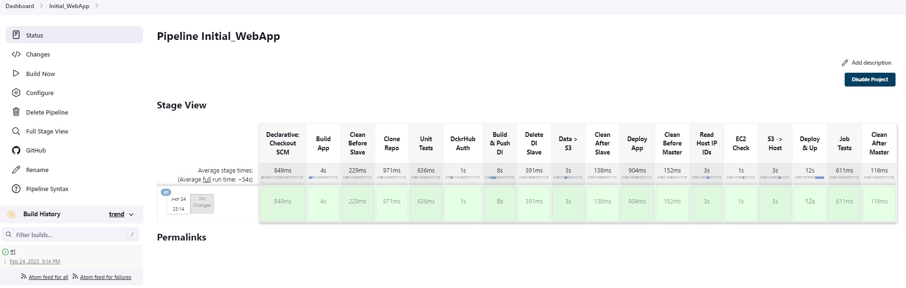

# Final Project "Deployment infrastructure and website "Python Bytes Club's Blog"

## Mykhailo Solomashenko

### Step L1  EPAM DevOps Fundamentals Spring 2022
  
#### Webpage: <http://blog-soloma70.pp.ua>
  
---  
**Software Tools:**

1. Club's Blog Wep App on `Django Python`
2. Building pipelines - `Jenkins`
3. Containerization - `Docker`
4. Raising the infrastructure on AWS - `Terraform`
5. Initial setup of the EC2 Instance software on AWS - `Ansible`

---
**Preconditions:**

1. A `WebApp-Master` instance was created, later `Master-Node`.
2. A `WebApp-Slave` instance was created, later `Slave-Node`.
3. Create `SG` with the inbound rules on ports 22, 80, 443, 8080.
4. Create `Elastic IP` and attach `WebApp-Master` (for GitHub webhook).
5. Create `Hosted zone` in the Route53 and attach domain `blog-soloma70.pp.ua`.
6. Create S3 Bucket - `soloma-webapp-blog` - to store the website database (SQLite3), media data, docker files, intermediate data, and the Terraform backend.
7. On  Master-Node:  
  a) install `Jenkins` + `GitHub`, `Ansible`, `SSH Agent` plugins;  
  b) install `AWS CLI`;  
  c) add AWS credentials in - `/tmp/.aws/aws`;  
  d) add Jenkins SSH private Key with name `aws_deploy_iaac`- `app_aws`;  
  `app_aws.pub` - located on dir `.cred` project `ansible_terraform`;  
  e) Add Jenkins DockerHub credential with name `dockerhub-soloma` (login/passwd).  
8. On  Slave-Node:  
  a) install `Docker`, `Docker Compose`, `Ansible`, `Terraform`;  
  b) install `AWS CLI`;  
  c) add AWS credentials in - `/home/ubuntu/.aws/aws`.  

---

## The project implementation was divided into 3 stages

### I. Raising Infrastructure on AWS (Terraform) and initial installation of the necessary software (Ansible)  

The name is `IaaC_WebBlog`.  
The whole project is in one directory `ansible-terraform`.  
Source Repo – <https://github.com/soloma70/ansible_terraform.git>.  

1. Deploying Infrastructure — files `main.tf`, `variables.tf`, `outputs.tf`:  
  a) create Key Pair;  
  b) create Elastic IP;  
  c) create records on the Hosted Zone Route53 (attach Elastic IP);  
  d) create Security Group with necessary rules;  
  e) up instance EC2 “WebApp-Prod” with previously created data.  
2. Update Linux and installation Pip3, Virtualenv & Docker; check inslall – files `playbook.yml`, `ansible.cfg`, dir – `group_vars` with file `all`. File `hosts` formed from `outputs.tf` through S3 Bucket `soloma-webapp-blog`.
3. Deployment is handled by Jenkins – `Jenkinsfile`. There are some points to be noted here:  
  a) Terraform and Ansible work is done on the Slave-Node (`ubuntu-terraform`, `ubuntu-docker`);  
  b) include stage `EC2 Wait` that waits for an instance to start;  
  c) on S3 Bucket saves received from Terraform Output files – `hosts`, `ids`, `region`;  
  d) the pipeline is parameterized; at startup, choose to raise or destroy infrastructure.  

---

### II.  Initial installation WebApp on the instance EC2 created in the previous step  

The name is `Initial_WebBlog`.  
Source Repo – <https://github.com/soloma70/webapp_blog.git>.  
At this stage, the `Jenkinsfile` located in the `/jenkins/initial` directory is used.  
Pipeline starts through the trigger `Build after other projects are built` – `IaaC_WebBlog`.  

1. First step. Job is performed on the Slave-Node (`ubuntu-terraform`, `ubuntu-docker`):  
  a) cloning the repository;  
  b) testing of the Django Tests;  
  c) assembly of the Docker container with the web app and send it to DockerHub;  
  d) in addition, sending to S3 Bucket `db`, `media` and `docker-compose.yml` files.
2. Second step. Job is performed on the Master-Node (`ubuntu-master`):  
  a) download `hosts`, `ids`, `region` from S3 Bucket and check EC2 Instance `WebApp-Prod`;  
  b) copy `db`, `media` and `docker-compose.yml` files from S3 Bucket on the EC2 Instance `WebApp-Prod`;  
  c) Run Docker Compose on the EC2 Instance `WebApp-Prod`;  
  d) testing the access to `WepApp_Blog` in Internet.  

---

### III.  Continuous Integration / Continuous Delivery WebApp  

The name is `CICD_WebBlog`.  
Source Repo – <https://github.com/soloma70/webapp_blog.git>.  
At this stage, the `Jenkinsfile` located in the `/jenkins/cicd` directory is used.  
Pipeline starts through the trigger `Trigger builds remotely`, when adding new commits to the repo.  

1. First step. Job is performed on the Slave-Node (`ubuntu-terraform`, `ubuntu-docker`):  
  a) cloning the repository;  
  b) testing of the Django Tests;  
  c) assembly of the Docker container with the web app and send it to DockerHub;  
  d) in addition, sending to S3 Bucket `docker-compose.yml` & `docker-compose-prev.yml` files.  
2. Second step. Job is performed on the Master-Node (`ubuntu-master`):  
  a) download `hosts`, `ids`, `region` from S3 Bucket and check EC2 Instance `WebApp-Prod`;  
  b) Down site `WepApp_Blog` (on Docker container);  
  c) copy `db` & `media` files from EC2 Instance `WebApp-Prod` on the S3 Bucket;  
  d) copy compose files from S3 Bucket on the EC2 Instance `WebApp-Prod`;  
  e) Run Docker Compose file on the EC2 Instance `WebApp-Prod`;  
  f) testing the access to `WepApp_Blog` in Internet.  

---

### Jenkins Jobs

### Web Site:

