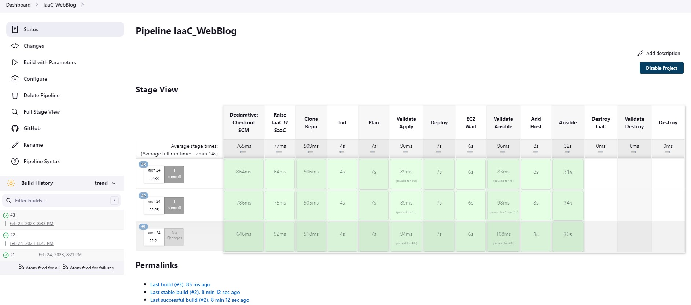
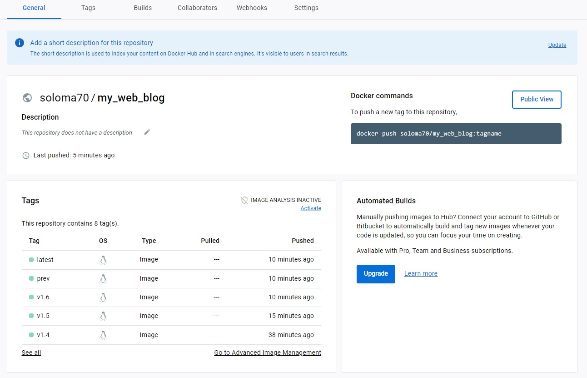

# Final Project "CI/CD Pipeline: From committing code changes to deploying an AWS resourses"

## Mykhailo Solomashenko

### Step L1  EPAM DevOps Fundamentals Spring 2022
  
#### Webpage: <http://blog-soloma70.pp.ua>
  
---  
**Software Tools:**

1. Club's Blog Wep App on Django Python
2. Building pipelines - Jenkins
3. Containerization - Docker
4. Raising the infrastructure on AWS - Terraform
5. Initial setup of the EC2 Instance software on AWS - Ansible

---
**Directory contents:**

1. `jenkins_terraform_ansible` - Jenkins file, Terraform files, Ansible files for raising & destroy ifrastructure.
2. `my_site` - Code for website "Python Bytes Club Blog", Docker & Docker Compose files, Jenkins file.
3. `screenshots` - Available screenshots.

---

1. IaaC Pipeline:

2. Initial setup:

3. CI/CD Pipeline:

4. Web Site:

